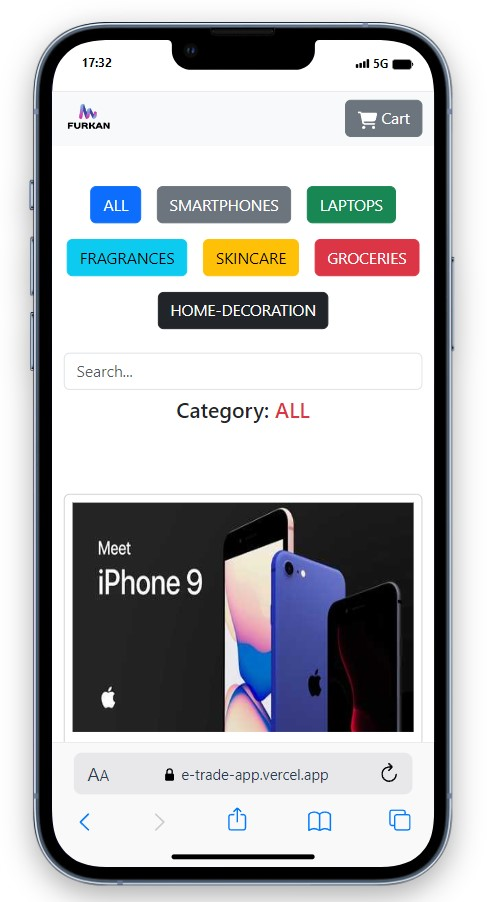
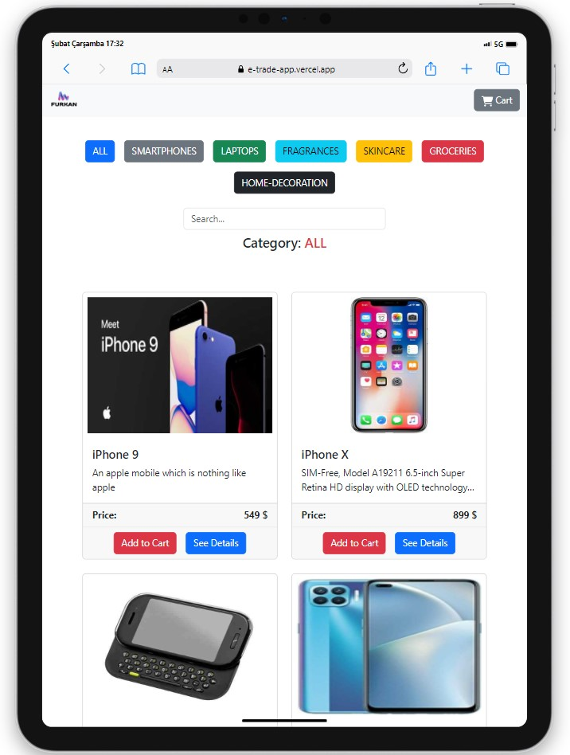
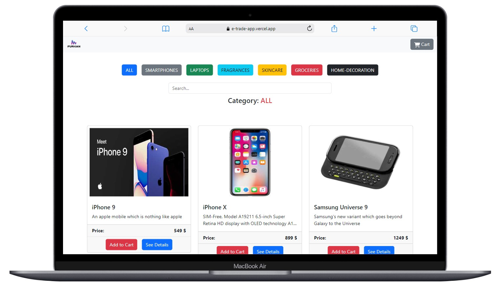

# Shopping App

<div align="center">
  
</div>

## About the Project

Welcome to the Shopping App! This web application I built with React allows users to discover products, add them to the shopping basket, and view details about each product.

## Table of Contents

- [Features](#features)
- [Technologies Used](#technologies-used)
- [Project Skeleton](#project-skeleton)
- [Screenshots](#screenshots)

## Live Demo

[Shopping App](https://e-trade-app.vercel.app/)

## Features

- View a list of products with images, titles, descriptions, and prices.
- Filter products by category and search for specific items.
- Add products to the shopping cart.
- View details about each product in a modal.
- Remove items and adjust quantities in the shopping cart.
- See the total amount in the shopping cart.

## Technologies Used

- React
- Styling with [Bootstrap](https://getbootstrap.com/) and [React-Bootstrap](https://react-bootstrap.netlify.app/)
- [DummyJSON API](https://dummyjson.com/) for products data
- [React-Icons](https://react-icons.github.io/react-icons/) for icons

## Project Skeleton

```
Shopping App (folder)
│
│----readme.md         
SOLUTION
├── public
│    └── index.html
├── src
│    ├── assets
│    │     └── images
│    ├── components
│    │     ├── Canvas.jsx
│    │     ├── CanvasCard.jsx  
│    │     ├── Modal.jsx       
│    │     ├── ModalImages.jsx       
│    │     ├── Navbar.jsx       
│    │     ├── ProductCard.jsx       
│    │     └── Products.jsx  
│    ├── pages
│    │     └── Home.jsx 
│    ├── App.js
│    ├── index.css
│    └── index.js
├── package.json
└── yarn.lock
```

## Screenshots

<div align="center">
  
  
  
</div>

## Compatibility

The project is compatible with both wide-screen computers and mobile devices.

## Acknowledgments

Products data provided by [DummyJSON](https://dummyjson.com/)